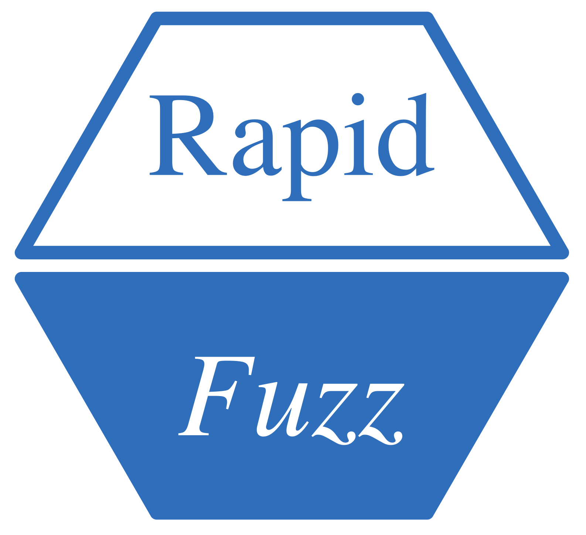

<!-- README.md is generated from README.Rmd. Please edit that file -->

# RapidFuzz <a href="https://github.com/StrategicProjects/RapidFuzz"></a>

<!-- badges: start -->


<!-- badges: end -->

Provides a high-performance interface for calculating string
similarities and distances, leveraging the efficient C++ library
[RapidFuzz](https://github.com/rapidfuzz/rapidfuzz-cpp) developed by Max
Bachmann and Adam Cohen. This package integrates the C++ implementation,
allowing R users to access cutting-edge algorithms for fuzzy matching
and text analysis.

## Installation

You can install directly from CRAN or the development version of pikchr
from [GitHub](https://github.com/) with:

``` r
# install.packages("pak")
pak::pak("StrategicProjects/RapidFuzz")

library(RapidFuzz)
```

## Overview

The `RapidFuzz` package is an R wrapper around the highly efficient
RapidFuzz C++ library. It provides implementations of multiple string
comparison and similarity metrics, such as Levenshtein, Jaro-Winkler,
and Damerau-Levenshtein distances. This package is particularly useful
for applications like record linkage, approximate string matching, and
fuzzy text processing.

String comparison algorithms calculate distances and similarities
between two sequences of characters. These distances help to quantify
how similar two strings are. For example, the Levenshtein distance
measures the minimum number of single-character edits required to
transform one string into another.

RapidFuzz leverages advanced algorithms to ensure high performance while
maintaining accuracy. The original library is open-source and can be
accessed on [RapidFuzz GitHub
Repository](https://github.com/rapidfuzz/RapidFuzz).

------------------------------------------------------------------------

## Functions

### Process String Function

- `processString()`: Process a string with options to trim, convert to
  lowercase, and transliterate to ASCII.

### Opcode Functions

- `opcodes_apply_str()`: Apply Opcodes to transform a string.
- `opcodes_apply_vec()`: Apply Opcodes to transform a string into a
  character vector.

### Edit Operation Utilities

- `get_editops()`: Retrieve Edit Operations between two strings.

### Edit Operations Functions

- `editops_apply_str()`: Apply Edit Operations to transform a string.
- `editops_apply_vec()`: Apply Edit Operations to transform a string
  into a character vector.

### Damerau-Levenshtein Functions

- `damerau_levenshtein_distance()`: Calculate the Damerau-Levenshtein
  Distance.
- `damerau_levenshtein_normalized_distance()`: Calculate the Normalized
  Damerau-Levenshtein Distance.
- `damerau_levenshtein_normalized_similarity()`: Calculate the
  Normalized Damerau-Levenshtein Similarity.
- `damerau_levenshtein_similarity()`: Calculate the Damerau-Levenshtein
  Similarity.

### Fuzz Ratio Functions

- `fuzz_QRatio()`: Perform a Quick Ratio Calculation.
- `fuzz_WRatio()`: Perform a Weighted Ratio Calculation.
- `fuzz_partial_ratio()`: Calculate Partial Ratio.
- `fuzz_ratio()`: Calculate a Simple Ratio.
- `fuzz_token_ratio()`: Calculate Combined Token Ratio.
- `fuzz_token_set_ratio()`: Perform Token Set Ratio Calculation.
- `fuzz_token_sort_ratio()`: Perform Token Sort Ratio Calculation.

### Hamming Functions

- `hamming_distance()`: Calculate Hamming Distance.
- `hamming_normalized_distance()`: Calculate Normalized Hamming
  Distance.
- `hamming_normalized_similarity()`: Calculate Normalized Hamming
  Similarity.
- `hamming_similarity()`: Calculate Hamming Similarity.

### Indel Functions

- `indel_distance()`: Calculate Indel Distance.
- `indel_normalized_distance()`: Calculate Normalized Indel Distance.
- `indel_normalized_similarity()`: Calculate Normalized Indel
  Similarity.
- `indel_similarity()`: Calculate Indel Similarity.

### Jaro Functions

- `jaro_distance()`: Calculate Jaro Distance.
- `jaro_normalized_distance()`: Calculate Normalized Jaro Distance.
- `jaro_normalized_similarity()`: Calculate Normalized Jaro Similarity.
- `jaro_similarity()`: Calculate Jaro Similarity.

### Jaro-Winkler Functions

- `jaro_winkler_distance()`: Calculate Jaro-Winkler Distance.
- `jaro_winkler_normalized_distance()`: Calculate Normalized
  Jaro-Winkler Distance.
- `jaro_winkler_normalized_similarity()`: Calculate Normalized
  Jaro-Winkler Similarity.
- `jaro_winkler_similarity()`: Calculate Jaro-Winkler Similarity.

### Longest Common Subsequence (LCSseq) Functions

- `lcs_seq_distance()`: Calculate LCSseq Distance.
- `lcs_seq_editops()`: Retrieve LCSseq Edit Operations.
- `lcs_seq_normalized_distance()`: Calculate Normalized LCSseq Distance.
- `lcs_seq_normalized_similarity()`: Calculate Normalized LCSseq
  Similarity.
- `lcs_seq_similarity()`: Calculate LCSseq Similarity.

### Levenshtein Functions

- `levenshtein_distance()`: Calculate Levenshtein Distance.
- `levenshtein_normalized_distance()`: Calculate Normalized Levenshtein
  Distance.
- `levenshtein_normalized_similarity()`: Calculate Normalized
  Levenshtein Similarity.
- `levenshtein_similarity()`: Calculate Levenshtein Similarity.

### Optimal String Alignment (OSA) Functions

- `osa_distance()`: Calculate Distance Using OSA.
- `osa_editops()`: Retrieve Edit Operations Using OSA.
- `osa_normalized_distance()`: Calculate Normalized Distance Using OSA.
- `osa_normalized_similarity()`: Calculate Normalized Similarity Using
  OSA.
- `osa_similarity()`: Calculate Similarity Using OSA.

### Prefix Functions

- `prefix_distance()`: Calculate the Prefix Distance between two
  strings.
- `prefix_normalized_distance()`: Calculate the Normalized Prefix
  Distance between two strings.
- `prefix_normalized_similarity()`: Calculate the Normalized Prefix
  Similarity between two strings.
- `prefix_similarity()`: Calculate the Prefix Similarity between two
  strings.

------------------------------------------------------------------------

## Example Usage

### Prefix Functions

``` r
prefix_distance("abcdef", "abcxyz")
# Output: 3

prefix_normalized_similarity("abcdef", "abcxyz", score_cutoff = 0.0)
# Output: 0.5
```

### Postfix Functions

``` r
postfix_distance("abcdef", "xyzdef")
# Output: 3
```

### Damerau-Levenshtein Functions

``` r
damerau_levenshtein_distance("abcdef", "abcfed")
# Output: 2
```

### Extract Matches

``` r
# Example data
query <- "new york jets"
choices <- c("Atlanta Falcons", "New York Jets", "New York Giants", "Dallas Cowboys")
score_cutoff <- 0.0
# Find the best match
extract_matches(query, choices, score_cutoff, scorer = "PartialRatio")
# Output:
#            choice     score
# 1   New York Jets 100.00000
# 2 New York Giants  81.81818
# 3 Atlanta Falcons  33.33333
```

------------------------------------------------------------------------

### Original Library

The `RapidFuzz` package is a wrapper of the
[RapidFuzz](https://github.com/rapidfuzz/RapidFuzz) C++ library,
developed by Max Bachmann and Adam Cohen. The library implements
efficient algorithms for approximate string matching and comparison.

<center>

[](https://rapidfuzz.github.io/RapidFuzz/)\]
</center>
